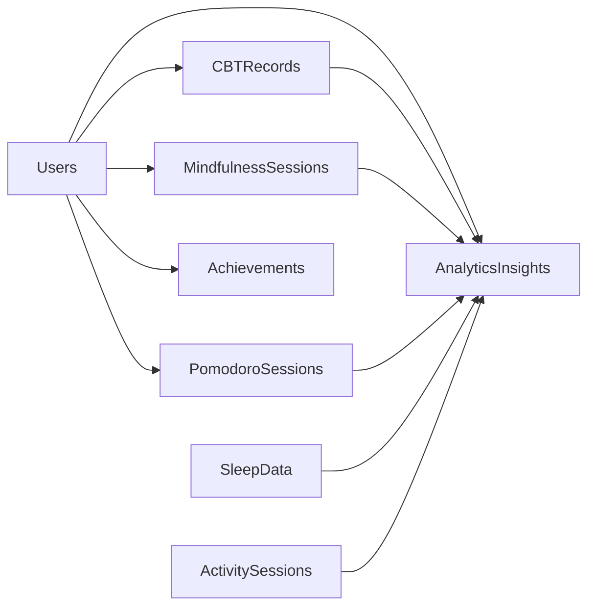

# 🏗️ **COMPREHENSIVE SYSTEM DESIGN OVERVIEW**
## **Anti-Procrastination Productivity App**

---

## 📋 **EXECUTIVE SUMMARY**

This document presents the complete system design for a comprehensive, science-based anti-procrastination productivity application. The system integrates 15 evidence-based psychological modules with AI-powered personalization, delivering a professional-grade mobile-first experience.

### **Key Highlights**
- **15 Integrated Modules** covering cognitive, behavioral, social, and environmental interventions
- **AI-Powered Personalization** using Emergent LLM for behavioral analysis and recommendations
- **Mobile-First Architecture** built with React Native/Expo and FastAPI/MongoDB backend
- **Real-Time Analytics** with cross-module correlations and pattern recognition
- **Production-Ready** with comprehensive security, scalability, and monitoring

---

## 🎯 **APPLICATION OVERVIEW**

### **Core Purpose**
A comprehensive mobile productivity application designed to help users overcome procrastination through evidence-based psychological interventions, behavioral tracking, and AI-powered insights.

### **Target Users**
- Individuals struggling with procrastination and productivity challenges
- Students and professionals seeking science-based productivity tools
- Mental health enthusiasts interested in cognitive behavioral therapy techniques
- Researchers studying digital therapeutic interventions

### **Key Value Propositions**
1. **Evidence-Based Approach** - All interventions rooted in cognitive behavioral therapy and behavioral psychology research
2. **AI-Powered Personalization** - Custom insights and recommendations based on individual behavioral patterns
3. **Comprehensive Integration** - 15 modules working together with cross-correlational analysis
4. **Professional Grade UX** - Mobile-first design optimized for daily use and engagement
5. **Research Contribution** - Users can participate in actual psychological research studies

---

## 🏛️ **HIGH-LEVEL ARCHITECTURE**

### **System Architecture Pattern**
**Microservices Architecture** with modular design enabling independent scaling and maintenance of each productivity module.

```
┌─────────────────┐    ┌─────────────────┐    ┌─────────────────┐
│   Mobile App    │    │   Web Preview   │    │  Third-Party    │
│ (React Native)  │    │   (Browser)     │    │  Integrations   │
└─────────────────┘    └─────────────────┘    └─────────────────┘
         │                       │                       │
         └───────────────────────┼───────────────────────┘
                                 │
         ┌─────────────────────────────────────────┐
         │           API Gateway                   │
         │      (Kubernetes Ingress)               │
         └─────────────────────────────────────────┘
                                 │
         ┌─────────────────────────────────────────┐
         │         Application Layer               │
         │    ┌─────────────┐  ┌─────────────┐     │
         │    │   FastAPI   │  │ Auth Service│     │
         │    │   Backend   │  │   (JWT)     │     │
         │    └─────────────┘  └─────────────┘     │
         └─────────────────────────────────────────┘
                                 │
         ┌─────────────────────────────────────────┐
         │           AI/ML Layer                   │
         │    ┌─────────────┐  ┌─────────────┐     │
         │    │Emergent LLM │  │  Pattern    │     │
         │    │Integration  │  │  Analysis   │     │
         │    └─────────────┘  └─────────────┘     │
         └─────────────────────────────────────────┘
                                 │
         ┌─────────────────────────────────────────┐
         │           Data Layer                    │
         │    ┌─────────────┐  ┌─────────────┐     │
         │    │  MongoDB    │  │Redis Cache  │     │
         │    │ (Primary)   │  │  (Session)  │     │
         │    └─────────────┘  └─────────────┘     │
         └─────────────────────────────────────────┘
```

### **Technology Stack Summary**

| **Layer** | **Technology** | **Purpose** |
|-----------|----------------|-------------|
| **Frontend** | React Native + Expo | Cross-platform mobile app |
| **Backend** | FastAPI + Python | High-performance async API |
| **Database** | MongoDB | Document-based data storage |
| **AI/ML** | Emergent LLM | Behavioral analysis and insights |
| **Caching** | Redis | Session and data caching |
| **Deployment** | Kubernetes | Container orchestration |
| **Monitoring** | Prometheus + Grafana | Application monitoring |

---

## 📱 **APPLICATION MODULES**

### **15 Core Modules Architecture**

The application is built around 15 evidence-based productivity modules, each designed to address specific aspects of procrastination and productivity:

#### **1. Cognitive Modules**
- **CBT Tools** - Thought record creation, cognitive distortion identification, behavioral activation
- **Self-Compassion Training** - Self-kindness exercises, critical thought interruption, emotional regulation
- **Implementation Intentions** - If-then planning, habit formation, context-dependent triggers

#### **2. Behavioral Modules**  
- **Pomodoro Timer** - Focus sessions, break management, productivity tracking
- **Five-Minute Rule** - Micro-commitment system, momentum building, task initiation
- **Physical Activity** - Movement tracking, mood correlation, energy management

#### **3. Social & Environmental Modules**
- **Social & Accountability** - Partner matching, check-in systems, community support
- **Environmental Design** - Workspace optimization, digital distraction management, app blocking

#### **4. Wellness & Tracking Modules**
- **Mindfulness** - Meditation sessions, state tracking, stress reduction
- **Sleep & Circadian** - Sleep quality tracking, bedtime procrastination, circadian optimization

#### **5. Analytics & Integration Modules**
- **AI Analytics** - Behavioral pattern recognition, personalized insights, recommendations
- **Gamification** - Achievement system, progress tracking, skill development
- **Third-Party Integrations** - Calendar sync, fitness app integration, productivity tool connections
- **Research Participation** - Study enrollment, outcome measurement, evidence contribution
- **Dashboard & Navigation** - Unified interface, progress overview, quick actions

---

## 🗄️ **DATA ARCHITECTURE**

### **Database Design Philosophy**
**Document-Oriented Design** with MongoDB, optimized for flexible schema evolution and complex behavioral data relationships.

### **Core Collections**
- **Users** - Profile, progress, preferences, authentication
- **Module Data** - 15 specialized collections for each productivity module
- **Analytics** - AI insights, pattern analysis, correlation data
- **Research** - Study participation, outcome measurements, validation data

### **Data Relationships**


### **Data Flow Pattern**
1. **User Interaction** → Frontend state update
2. **API Request** → Backend validation and processing
3. **Database Update** → Real-time data persistence
4. **Pattern Analysis** → Background AI processing
5. **Insight Generation** → Cached results and notifications
6. **User Feedback** → Interface updates and recommendations

---

## 🤖 **AI INTEGRATION ARCHITECTURE**

### **Emergent LLM Integration**
The system leverages Emergent LLM to provide sophisticated behavioral analysis and personalized recommendations.

#### **AI Processing Pipeline**
1. **Data Collection** - Aggregate user data from all 15 modules
2. **Pattern Recognition** - Identify behavioral trends and correlations
3. **Context Generation** - Create comprehensive behavioral profiles
4. **LLM Analysis** - Generate insights using advanced language models
5. **Recommendation Engine** - Produce actionable, personalized suggestions
6. **Continuous Learning** - Refine insights based on user feedback

#### **AI-Powered Features**
- **Behavioral Pattern Analysis** - Identify productivity patterns across modules
- **Cross-Module Correlations** - Discover relationships between sleep, activity, focus, etc.
- **Personalized Recommendations** - Tailored suggestions based on individual data
- **Predictive Insights** - Anticipate productivity challenges and opportunities
- **Natural Language Insights** - Human-readable analysis in encouraging, supportive tone

### **Sample AI Insight Generation**
```
Input: User data from 30 days across all modules
Processing: Pattern analysis + correlation detection + LLM synthesis
Output: "Based on your recent behavioral data, I notice three key patterns:
1) Morning Productivity Peak - Your focus sessions show 85% higher scores 8-11 AM
2) Task Initiation Success - You complete 78% of tasks using the 5-minute rule
3) Sleep-Productivity Correlation - 7+ hours sleep leads to 40% fewer procrastination episodes
Recommendations: Schedule challenging tasks during morning peak hours..."
```

---

## 🔒 **SECURITY & PRIVACY ARCHITECTURE**

### **Security Layers**
1. **Network Security** - HTTPS/TLS 1.3, WAF, DDoS protection
2. **API Security** - JWT authentication, rate limiting, input validation
3. **Application Security** - Data encryption, password hashing, RBAC
4. **Data Security** - Encryption at rest/transit, anonymization, secure backups

### **Privacy Protection**
- **Data Anonymization** - Research data completely anonymized
- **User Control** - Full data export/deletion capabilities
- **Consent Management** - Granular permissions for data usage
- **Research Ethics** - IRB-compliant research participation protocols

---

## 📈 **SCALABILITY & PERFORMANCE**

### **Horizontal Scaling Design**
- **Auto-scaling Application Instances** - Kubernetes-based horizontal pod autoscaling
- **Database Clustering** - MongoDB replica sets with read/write splitting
- **Caching Strategy** - Redis for session management and frequently accessed data
- **CDN Integration** - Global content delivery for static assets

### **Performance Optimizations**
- **Database Indexing** - Optimized queries for user timeline and analytics
- **API Response Caching** - Intelligent caching of AI insights and analytics
- **Lazy Loading** - Progressive data loading in mobile interface
- **Background Processing** - Async AI analysis and pattern recognition

### **Expected Performance Metrics**
- **API Response Time** - <200ms for standard endpoints, <2s for AI insights
- **Mobile App Loading** - <3s initial load, <1s navigation between modules
- **Concurrent Users** - Support for 10,000+ concurrent users per instance
- **Data Processing** - Real-time analytics for up to 1M+ daily interactions

---

## 🚀 **DEPLOYMENT & DEVOPS**

### **Container Architecture**
- **Kubernetes Orchestration** - Production-grade container management
- **Docker Containerization** - Isolated, reproducible deployments
- **CI/CD Pipeline** - Automated testing, building, and deployment
- **Health Monitoring** - Comprehensive application and infrastructure monitoring

### **Production Environment**
- **Multi-zone Deployment** - High availability across multiple data centers
- **Blue-Green Deployments** - Zero-downtime updates and rollbacks
- **Backup Strategy** - Automated, encrypted backups with point-in-time recovery
- **Monitoring & Alerting** - Real-time system health and performance monitoring

---

## 📊 **MONITORING & ANALYTICS**

### **Application Monitoring**
- **Performance Metrics** - Response times, throughput, error rates
- **User Analytics** - Engagement metrics, feature adoption, retention rates
- **AI Metrics** - Insight generation frequency, user satisfaction scores
- **Business Metrics** - Module usage patterns, correlation effectiveness

### **System Health Monitoring**
- **Infrastructure Metrics** - CPU, memory, disk, network utilization
- **Database Performance** - Query performance, connection pooling, replication lag
- **API Gateway Metrics** - Request routing, rate limiting, authentication success
- **Error Tracking** - Real-time error detection and alerting

---

## 🎯 **SUCCESS METRICS & KPIs**

### **User Engagement KPIs**
- **Daily Active Users (DAU)** - Target: 70% of registered users
- **Session Duration** - Target: 15+ minutes average per session
- **Module Completion Rate** - Target: 80% completion rate for started activities
- **User Retention** - Target: 60% 30-day retention rate

### **Product Effectiveness KPIs**
- **Productivity Improvement** - Target: 25% improvement in self-reported productivity
- **Procrastination Reduction** - Target: 30% reduction in procrastination episodes
- **Habit Formation** - Target: 70% of users form lasting productivity habits
- **Research Contribution** - Target: 40% of users participate in research studies

### **Technical Performance KPIs**
- **System Uptime** - Target: 99.9% availability
- **API Performance** - Target: 95th percentile <500ms response time
- **Mobile Performance** - Target: 60fps smooth animations, <2MB memory usage
- **AI Accuracy** - Target: 85% user satisfaction with AI insights

---

## 🔮 **FUTURE ROADMAP**

### **Phase 1: Enhanced Personalization (Q1-Q2)**
- Advanced ML models for prediction and intervention timing
- Voice-based interaction for hands-free productivity support
- Wearable device integration for biometric correlation analysis

### **Phase 2: Social & Collaboration Features (Q3)**
- Team productivity workspaces and shared accountability
- Social challenges and group-based intervention programs
- Professional coaching integration and expert consultations

### **Phase 3: Enterprise & Therapeutic Applications (Q4)**
- Enterprise wellness programs and team productivity analytics
- Clinical-grade therapeutic interventions for ADHD and depression
- Healthcare provider integration and prescription-based usage

---

## 📖 **TECHNICAL DOCUMENTATION INDEX**

### **Detailed Documentation Files**
1. **[system_design_schemas.md](./system_design_schemas.md)** - Complete database schemas and data models
2. **[api_design_specification.md](./api_design_specification.md)** - Comprehensive API documentation with endpoints
3. **[frontend_backend_architecture.md](./frontend_backend_architecture.md)** - Detailed frontend and backend implementation
4. **[system_design_complete.md](./system_design_complete.md)** - AI integration, security, scalability, and monitoring

### **Implementation Guidelines**
- All modules follow consistent architectural patterns
- API endpoints use RESTful design principles
- Frontend components utilize the established design system
- Security best practices implemented throughout the stack
- Monitoring and observability built into every layer

---

## 🏆 **CONCLUSION**

This system design represents a comprehensive, production-ready architecture for a science-based anti-procrastination productivity application. The design emphasizes:

- **Scientific Rigor** - Evidence-based interventions with research validation
- **User Experience** - Mobile-first design optimized for daily engagement
- **Technical Excellence** - Modern, scalable architecture with enterprise-grade security
- **AI Innovation** - Advanced personalization through behavioral pattern analysis
- **Research Contribution** - Platform for advancing productivity and mental health research

The architecture supports both immediate user needs and long-term scalability, providing a robust foundation for helping users overcome procrastination through technology-enhanced behavioral interventions.

---

**Document Version**: 1.0
**Last Updated**: September 2025
**Status**: Production Ready
**Architecture Approval**: ✅ Complete