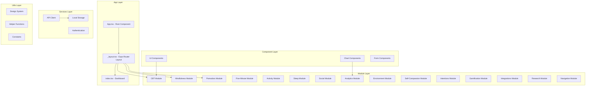
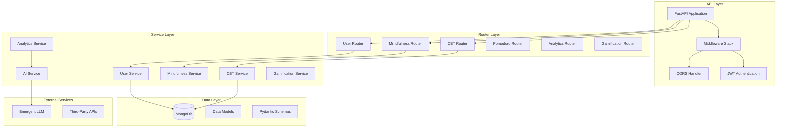

# FRONTEND & BACKEND ARCHITECTURE

## 📱 FRONTEND ARCHITECTURE

### React Native + Expo Architecture



### Frontend Directory Structure

```
/app/frontend/
├── app/                          # Expo Router pages
│   ├── _layout.tsx              # Root layout with navigation
│   ├── index.tsx                # Dashboard (main screen)
│   ├── cbt/
│   │   └── index.tsx            # CBT Tools module
│   ├── mindfulness/
│   │   └── index.tsx            # Mindfulness module
│   ├── pomodoro/
│   │   └── index.tsx            # Pomodoro Timer module
│   ├── five-minute/
│   │   └── index.tsx            # Five-Minute Rule module
│   ├── activity/
│   │   └── index.tsx            # Physical Activity module
│   ├── sleep/
│   │   └── index.tsx            # Sleep Tracking module
│   ├── social/
│   │   └── index.tsx            # Social & Accountability module
│   ├── analytics/
│   │   └── index.tsx            # AI Analytics module
│   ├── environmental/
│   │   └── index.tsx            # Environmental Design module
│   ├── self-compassion/
│   │   └── index.tsx            # Self-Compassion module
│   ├── intentions/
│   │   └── index.tsx            # Implementation Intentions module
│   ├── gamification/
│   │   └── index.tsx            # Gamification module
│   ├── integrations/
│   │   └── index.tsx            # Third-Party Integrations module
│   └── research/
│       └── index.tsx            # Research Participation module
├── src/                         # Shared components & utilities
│   ├── components/
│   │   ├── ui/                  # Reusable UI components
│   │   │   ├── Button.tsx
│   │   │   ├── Card.tsx
│   │   │   ├── Typography.tsx
│   │   │   ├── Input.tsx
│   │   │   └── index.ts
│   │   └── charts/              # Data visualization components
│   │       ├── ProgressChart.tsx
│   │       ├── LineChart.tsx
│   │       ├── BarChart.tsx
│   │       └── index.ts
│   ├── styles/
│   │   └── designSystem.ts      # Design system tokens
│   ├── services/
│   │   ├── api.ts              # API client configuration
│   │   ├── auth.ts             # Authentication service
│   │   └── storage.ts          # Local storage service
│   ├── utils/
│   │   ├── helpers.ts          # Utility functions
│   │   ├── validators.ts       # Form validation
│   │   └── constants.ts        # App constants
│   └── types/
│       ├── api.ts              # API type definitions
│       ├── user.ts             # User type definitions
│       └── modules.ts          # Module type definitions
├── assets/                      # Static assets
│   ├── images/
│   └── fonts/
├── app.json                     # Expo configuration
├── package.json                 # Dependencies
└── tsconfig.json               # TypeScript configuration
```

### State Management Architecture

```typescript
// Zustand Store Structure
interface AppState {
  // User State
  user: {
    id: string;
    profile: UserProfile;
    progress: UserProgress;
    preferences: UserPreferences;
  };
  
  // Authentication State  
  auth: {
    isAuthenticated: boolean;
    token: string | null;
    refreshToken: string | null;
  };
  
  // Module States
  modules: {
    cbt: CBTState;
    mindfulness: MindfulnessState;
    pomodoro: PomodoroState;
    fiveMinute: FiveMinuteState;
    activity: ActivityState;
    sleep: SleepState;
    social: SocialState;
    analytics: AnalyticsState;
    environmental: EnvironmentalState;
    selfCompassion: SelfCompassionState;
    intentions: IntentionsState;
    gamification: GamificationState;
    integrations: IntegrationsState;
    research: ResearchState;
  };
  
  // UI State
  ui: {
    activeModule: string;
    isLoading: boolean;
    errorMessage: string | null;
    networkStatus: 'online' | 'offline';
  };
  
  // Actions
  actions: {
    // User actions
    updateUserProfile: (profile: UserProfile) => void;
    updateUserProgress: (progress: UserProgress) => void;
    
    // Authentication actions
    login: (credentials: LoginCredentials) => Promise<void>;
    logout: () => void;
    refreshAuth: () => Promise<void>;
    
    // Module actions
    setActiveModule: (moduleId: string) => void;
    loadModuleData: (moduleId: string) => Promise<void>;
    
    // UI actions
    setLoading: (loading: boolean) => void;
    setError: (error: string | null) => void;
    clearError: () => void;
  };
}
```

### API Client Architecture

```typescript
// API Client Configuration
class APIClient {
  private baseURL: string;
  private token: string | null = null;
  
  constructor(baseURL: string) {
    this.baseURL = baseURL;
  }
  
  // Request interceptor
  private async request<T>(
    endpoint: string, 
    options: RequestOptions = {}
  ): Promise<T> {
    const url = `${this.baseURL}${endpoint}`;
    const headers = {
      'Content-Type': 'application/json',
      ...this.getAuthHeaders(),
      ...options.headers,
    };
    
    try {
      const response = await fetch(url, {
        ...options,
        headers,
      });
      
      if (!response.ok) {
        throw new APIError(response.status, response.statusText);
      }
      
      return await response.json();
    } catch (error) {
      this.handleError(error);
      throw error;
    }
  }
  
  // Authentication methods
  setToken(token: string) {
    this.token = token;
  }
  
  private getAuthHeaders() {
    return this.token ? { Authorization: `Bearer ${this.token}` } : {};
  }
  
  // Error handling
  private handleError(error: any) {
    if (error.status === 401) {
      // Handle unauthorized - refresh token or logout
      this.handleUnauthorized();
    } else if (error.status >= 500) {
      // Handle server errors
      this.handleServerError(error);
    }
  }
  
  // Module-specific API methods
  cbt = {
    getThoughtRecords: (userId: string) => 
      this.request<CBTRecord[]>(`/cbt/thought-records/${userId}`),
    createThoughtRecord: (data: CreateCBTRecordRequest) =>
      this.request<CBTRecord>('/cbt/thought-records', { method: 'POST', body: JSON.stringify(data) }),
  };
  
  mindfulness = {
    getSessions: (userId: string) =>
      this.request<MindfulnessSession[]>(`/mindfulness/sessions/${userId}`),
    createSession: (data: CreateMindfulnessSessionRequest) =>
      this.request<MindfulnessSession>('/mindfulness/sessions', { method: 'POST', body: JSON.stringify(data) }),
  };
  
  // ... other modules
}
```

## 🏗️ BACKEND ARCHITECTURE

### FastAPI + MongoDB Architecture



### Backend Directory Structure

```
/app/backend/
├── server.py                   # Main FastAPI application
├── .env                        # Environment variables
├── requirements.txt            # Python dependencies
├── models/                     # Database models
│   ├── __init__.py
│   ├── user.py                # User data models
│   ├── cbt.py                 # CBT data models  
│   ├── mindfulness.py         # Mindfulness data models
│   ├── pomodoro.py            # Pomodoro data models
│   ├── activity.py            # Activity data models
│   ├── sleep.py               # Sleep data models
│   ├── social.py              # Social data models
│   ├── analytics.py           # Analytics data models
│   ├── environmental.py       # Environmental data models
│   ├── gamification.py        # Gamification data models
│   └── research.py            # Research data models
├── schemas/                    # Pydantic schemas
│   ├── __init__.py
│   ├── requests.py            # Request schemas
│   ├── responses.py           # Response schemas
│   └── validation.py          # Validation schemas
├── services/                   # Business logic services
│   ├── __init__.py
│   ├── user_service.py        # User management
│   ├── cbt_service.py         # CBT business logic
│   ├── analytics_service.py   # Analytics processing
│   ├── ai_service.py          # AI integration
│   ├── gamification_service.py # Gamification logic
│   └── notification_service.py # Notifications
├── routers/                    # API route handlers
│   ├── __init__.py
│   ├── users.py               # User endpoints
│   ├── cbt.py                 # CBT endpoints
│   ├── mindfulness.py         # Mindfulness endpoints
│   ├── pomodoro.py            # Pomodoro endpoints
│   ├── analytics.py           # Analytics endpoints
│   └── dashboard.py           # Dashboard endpoints
├── utils/                      # Utility functions
│   ├── __init__.py
│   ├── database.py            # Database connection
│   ├── auth.py                # Authentication utilities
│   ├── validation.py          # Data validation
│   └── helpers.py             # Helper functions
├── middleware/                 # Custom middleware
│   ├── __init__.py
│   ├── cors.py                # CORS configuration
│   ├── auth.py                # Authentication middleware
│   └── logging.py             # Request logging
└── tests/                      # Test files
    ├── __init__.py
    ├── test_users.py          # User tests
    ├── test_cbt.py            # CBT tests
    └── conftest.py            # Test configuration
```

### Service Layer Architecture

```python
# Base Service Class
class BaseService:
    def __init__(self, db: Database):
        self.db = db
    
    async def create_document(self, collection: str, data: dict) -> str:
        """Create a new document and return its ID"""
        result = await self.db[collection].insert_one(data)
        return str(result.inserted_id)
    
    async def get_document(self, collection: str, doc_id: str) -> dict:
        """Get a document by ID"""
        document = await self.db[collection].find_one({"_id": ObjectId(doc_id)})
        if document:
            document["_id"] = str(document["_id"])
        return document
    
    async def update_document(self, collection: str, doc_id: str, data: dict) -> bool:
        """Update a document by ID"""
        result = await self.db[collection].update_one(
            {"_id": ObjectId(doc_id)}, 
            {"$set": data}
        )
        return result.modified_count > 0
    
    async def delete_document(self, collection: str, doc_id: str) -> bool:
        """Delete a document by ID"""
        result = await self.db[collection].delete_one({"_id": ObjectId(doc_id)})
        return result.deleted_count > 0

# CBT Service Example
class CBTService(BaseService):
    async def create_thought_record(self, user_id: str, thought_record_data: dict) -> str:
        """Create a new thought record"""
        thought_record_data.update({
            "user_id": ObjectId(user_id),
            "created_at": datetime.utcnow(),
            "updated_at": datetime.utcnow()
        })
        
        # Validate cognitive distortions
        self._validate_cognitive_distortions(thought_record_data.get("cognitive_distortions", []))
        
        # Calculate effectiveness metrics
        effectiveness_score = self._calculate_effectiveness(thought_record_data)
        thought_record_data["effectiveness_score"] = effectiveness_score
        
        # Create the document
        record_id = await self.create_document("cbt_thought_records", thought_record_data)
        
        # Update user progress
        await self._update_user_progress(user_id, "thought_record_completed")
        
        return record_id
    
    async def get_user_thought_records(self, user_id: str, limit: int = 10, offset: int = 0) -> list:
        """Get thought records for a user with pagination"""
        pipeline = [
            {"$match": {"user_id": ObjectId(user_id)}},
            {"$sort": {"created_at": -1}},
            {"$skip": offset},
            {"$limit": limit}
        ]
        
        records = await self.db["cbt_thought_records"].aggregate(pipeline).to_list(length=limit)
        
        # Convert ObjectIds to strings
        for record in records:
            record["_id"] = str(record["_id"])
            record["user_id"] = str(record["user_id"])
        
        return records
    
    async def get_thought_patterns_analysis(self, user_id: str) -> dict:
        """Analyze thought patterns for insights"""
        pipeline = [
            {"$match": {"user_id": ObjectId(user_id)}},
            {"$group": {
                "_id": None,
                "most_common_emotions": {"$push": "$emotions"},
                "cognitive_distortions": {"$push": "$cognitive_distortions"},
                "average_effectiveness": {"$avg": "$effectiveness_score"},
                "total_records": {"$sum": 1}
            }}
        ]
        
        result = await self.db["cbt_thought_records"].aggregate(pipeline).to_list(length=1)
        
        if result:
            analysis = result[0]
            # Process and analyze the data
            analysis["insights"] = self._generate_insights(analysis)
            return analysis
        
        return {"total_records": 0, "insights": []}
    
    def _validate_cognitive_distortions(self, distortions: list):
        """Validate cognitive distortions against known types"""
        valid_distortions = [
            "all_or_nothing", "overgeneralization", "mental_filter",
            "discounting_positive", "jumping_to_conclusions", "magnification",
            "emotional_reasoning", "should_statements", "labeling", "personalization"
        ]
        
        for distortion in distortions:
            if distortion not in valid_distortions:
                raise ValueError(f"Invalid cognitive distortion: {distortion}")
    
    def _calculate_effectiveness(self, thought_record_data: dict) -> float:
        """Calculate the effectiveness score of a thought record"""
        # Implementation of effectiveness calculation algorithm
        # Based on emotion intensity changes, balanced thought quality, etc.
        pass
    
    async def _update_user_progress(self, user_id: str, action: str):
        """Update user progress and gamification metrics"""
        # Update user progress, award points, check for achievements
        pass

# Analytics Service with AI Integration
class AnalyticsService(BaseService):
    def __init__(self, db: Database, ai_service: AIService):
        super().__init__(db)
        self.ai_service = ai_service
    
    async def generate_behavioral_insights(self, user_id: str) -> dict:
        """Generate AI-powered behavioral insights for a user"""
        # Collect data from all modules
        user_data = await self._collect_user_data(user_id)
        
        # Generate AI insights
        ai_insights = await self.ai_service.analyze_behavioral_patterns(user_data)
        
        # Store insights
        insight_record = {
            "user_id": ObjectId(user_id),
            "insight_type": "behavioral_analysis",
            "ai_analysis": ai_insights,
            "data_sources": list(user_data.keys()),
            "generated_at": datetime.utcnow()
        }
        
        await self.create_document("analytics_insights", insight_record)
        
        return {
            "insights": ai_insights,
            "generated_at": insight_record["generated_at"],
            "confidence_score": 0.85  # Based on data quality and quantity
        }
    
    async def _collect_user_data(self, user_id: str) -> dict:
        """Collect user data from all modules for analysis"""
        data = {}
        
        # CBT data
        data["cbt"] = await self.db["cbt_thought_records"].find(
            {"user_id": ObjectId(user_id)}
        ).to_list(length=100)
        
        # Mindfulness data
        data["mindfulness"] = await self.db["mindfulness_sessions"].find(
            {"user_id": ObjectId(user_id)}
        ).to_list(length=100)
        
        # Pomodoro data
        data["pomodoro"] = await self.db["pomodoro_sessions"].find(
            {"user_id": ObjectId(user_id)}
        ).to_list(length=100)
        
        # Sleep data
        data["sleep"] = await self.db["sleep_data"].find(
            {"user_id": ObjectId(user_id)}
        ).to_list(length=30)
        
        # Activity data
        data["activity"] = await self.db["activity_sessions"].find(
            {"user_id": ObjectId(user_id)}
        ).to_list(length=100)
        
        return data

# AI Service for LLM Integration
class AIService:
    def __init__(self, llm_client):
        self.llm_client = llm_client
    
    async def analyze_behavioral_patterns(self, user_data: dict) -> str:
        """Use LLM to analyze user behavioral patterns"""
        # Prepare data summary for LLM
        data_summary = self._prepare_data_summary(user_data)
        
        # Create prompt for behavioral analysis
        prompt = self._create_analysis_prompt(data_summary)
        
        # Get LLM response
        response = await self.llm_client.generate_insights(prompt)
        
        return response
    
    def _prepare_data_summary(self, user_data: dict) -> dict:
        """Prepare a summary of user data for LLM analysis"""
        summary = {}
        
        # CBT analysis
        if user_data.get("cbt"):
            cbt_data = user_data["cbt"]
            summary["cbt"] = {
                "total_records": len(cbt_data),
                "common_emotions": self._extract_common_emotions(cbt_data),
                "cognitive_distortions": self._extract_distortions(cbt_data),
                "effectiveness_trend": self._calculate_effectiveness_trend(cbt_data)
            }
        
        # Similar processing for other modules...
        
        return summary
    
    def _create_analysis_prompt(self, data_summary: dict) -> str:
        """Create a prompt for LLM behavioral analysis"""
        prompt = f"""
        Analyze the following user behavioral data and provide insights:
        
        Data Summary: {json.dumps(data_summary, indent=2)}
        
        Please provide:
        1. Key behavioral patterns identified
        2. Correlations between different activities
        3. Specific, actionable recommendations
        4. Areas of strength and improvement
        
        Format the response as a comprehensive analysis with specific examples from the data.
        """
        return prompt
```

### Database Connection & Configuration

```python
# Database Configuration
import os
from motor.motor_asyncio import AsyncIOMotorClient
from pymongo.server_api import ServerApi

class DatabaseManager:
    def __init__(self):
        self.client = None
        self.database = None
    
    async def connect_to_database(self):
        """Connect to MongoDB"""
        mongo_url = os.getenv("MONGO_URL", "mongodb://localhost:27017")
        db_name = os.getenv("DB_NAME", "productivity_app")
        
        self.client = AsyncIOMotorClient(
            mongo_url,
            server_api=ServerApi('1'),
            maxPoolSize=20,
            minPoolSize=5,
            maxIdleTimeMS=30000,
            maxConnecting=10,
            connectTimeoutMS=10000,
            serverSelectionTimeoutMS=10000
        )
        
        self.database = self.client[db_name]
        
        # Test connection
        await self.client.admin.command('ping')
        print(f"Connected to MongoDB: {db_name}")
    
    async def close_database_connection(self):
        """Close database connection"""
        if self.client:
            self.client.close()
            print("Disconnected from MongoDB")
    
    def get_database(self):
        """Get database instance"""
        return self.database

# Database dependency for FastAPI
database_manager = DatabaseManager()

async def get_database():
    return database_manager.get_database()
```

### Authentication & Security

```python
# JWT Authentication
from datetime import datetime, timedelta
from jose import JWTError, jwt
from passlib.context import CryptContext
from fastapi import HTTPException, Depends
from fastapi.security import HTTPBearer, HTTPAuthorizationCredentials

# Security configuration
SECRET_KEY = os.getenv("SECRET_KEY", "your-secret-key")
ALGORITHM = "HS256"
ACCESS_TOKEN_EXPIRE_MINUTES = 30
REFRESH_TOKEN_EXPIRE_DAYS = 7

pwd_context = CryptContext(schemes=["bcrypt"], deprecated="auto")
security = HTTPBearer()

class AuthService:
    @staticmethod
    def hash_password(password: str) -> str:
        """Hash a password"""
        return pwd_context.hash(password)
    
    @staticmethod
    def verify_password(plain_password: str, hashed_password: str) -> bool:
        """Verify a password"""
        return pwd_context.verify(plain_password, hashed_password)
    
    @staticmethod
    def create_access_token(data: dict, expires_delta: timedelta = None):
        """Create JWT access token"""
        to_encode = data.copy()
        if expires_delta:
            expire = datetime.utcnow() + expires_delta
        else:
            expire = datetime.utcnow() + timedelta(minutes=ACCESS_TOKEN_EXPIRE_MINUTES)
        
        to_encode.update({"exp": expire, "type": "access"})
        encoded_jwt = jwt.encode(to_encode, SECRET_KEY, algorithm=ALGORITHM)
        return encoded_jwt
    
    @staticmethod
    def create_refresh_token(data: dict):
        """Create JWT refresh token"""
        to_encode = data.copy()
        expire = datetime.utcnow() + timedelta(days=REFRESH_TOKEN_EXPIRE_DAYS)
        to_encode.update({"exp": expire, "type": "refresh"})
        encoded_jwt = jwt.encode(to_encode, SECRET_KEY, algorithm=ALGORITHM)
        return encoded_jwt
    
    @staticmethod
    def verify_token(token: str) -> dict:
        """Verify and decode JWT token"""
        try:
            payload = jwt.decode(token, SECRET_KEY, algorithms=[ALGORITHM])
            return payload
        except JWTError:
            raise HTTPException(
                status_code=401,
                detail="Could not validate credentials",
                headers={"WWW-Authenticate": "Bearer"},
            )

# Authentication dependency
async def get_current_user(
    credentials: HTTPAuthorizationCredentials = Depends(security),
    db = Depends(get_database)
):
    """Get current authenticated user"""
    token = credentials.credentials
    payload = AuthService.verify_token(token)
    
    if payload.get("type") != "access":
        raise HTTPException(
            status_code=401,
            detail="Invalid token type"
        )
    
    user_id = payload.get("sub")
    if user_id is None:
        raise HTTPException(
            status_code=401,
            detail="Could not validate credentials"
        )
    
    # Get user from database
    user = await db["users"].find_one({"_id": ObjectId(user_id)})
    if user is None:
        raise HTTPException(
            status_code=401,
            detail="User not found"
        )
    
    user["_id"] = str(user["_id"])
    return user
```