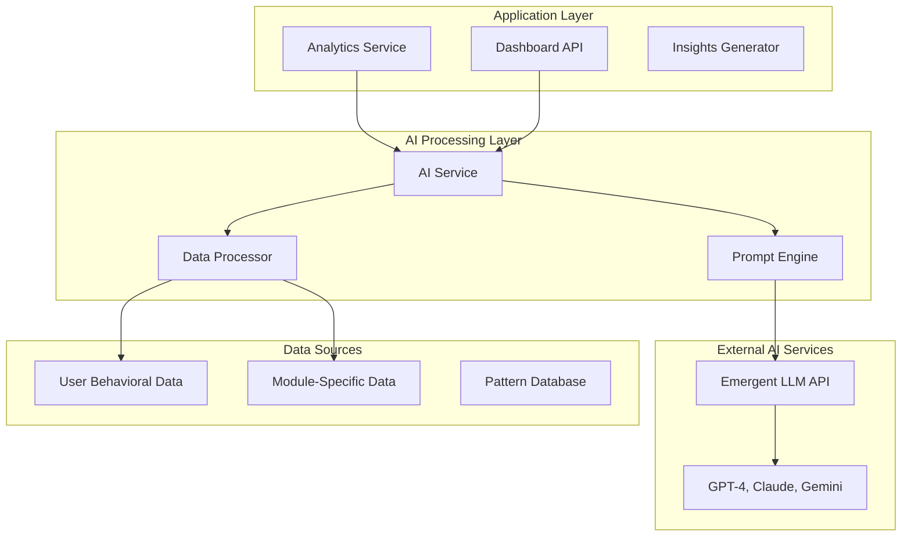
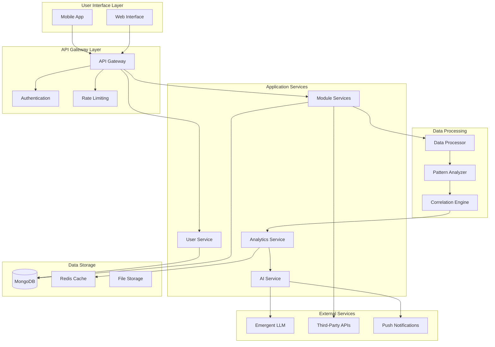
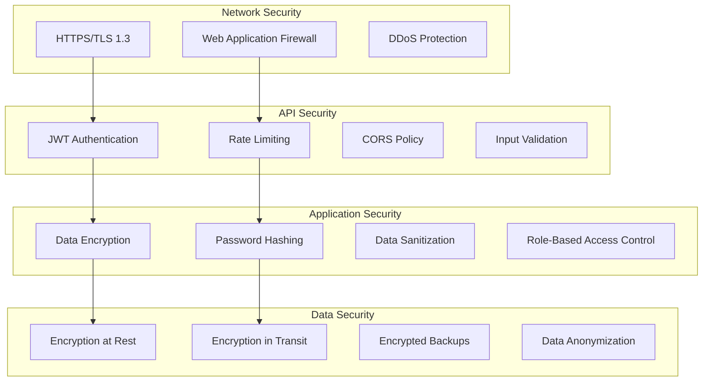
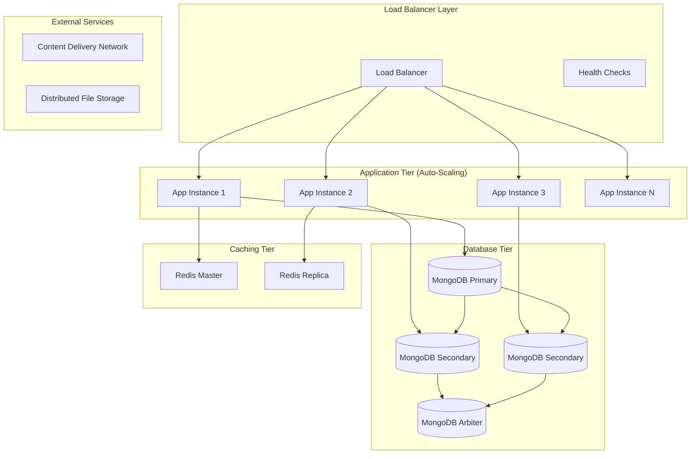

# COMPLETE SYSTEM DESIGN - REMAINING SECTIONS

## 🤖 AI INTEGRATION ARCHITECTURE

### Emergent LLM Integration



### AI Service Implementation

```python
class AIInsightsEngine:
    def __init__(self, emergent_client):
        self.emergent_client = emergent_client
        self.prompt_templates = self._load_prompt_templates()
    
    async def generate_comprehensive_insights(self, user_id: str) -> dict:
        """Generate comprehensive behavioral insights"""
        
        # 1. Collect and aggregate user data
        user_data = await self._collect_user_data(user_id)
        
        # 2. Calculate behavioral metrics
        behavioral_metrics = self._calculate_behavioral_metrics(user_data)
        
        # 3. Identify patterns and correlations
        patterns = self._identify_patterns(user_data)
        correlations = self._find_correlations(user_data)
        
        # 4. Generate AI-powered insights
        insights_prompt = self._create_insights_prompt(
            behavioral_metrics, patterns, correlations
        )
        
        ai_insights = await self.emergent_client.generate_insights(
            prompt=insights_prompt,
            max_tokens=2500,
            temperature=0.7
        )
        
        # 5. Generate personalized recommendations
        recommendations = await self._generate_recommendations(
            user_data, patterns, ai_insights
        )
        
        # 6. Structure the response
        return {
            "user_id": user_id,
            "generated_at": datetime.utcnow(),
            "behavioral_metrics": behavioral_metrics,
            "patterns_identified": patterns,
            "correlations": correlations,
            "ai_insights": ai_insights,
            "recommendations": recommendations,
            "confidence_score": self._calculate_confidence_score(user_data)
        }
    
    def _create_insights_prompt(self, metrics: dict, patterns: list, correlations: list) -> str:
        """Create a comprehensive prompt for AI analysis"""
        prompt = f"""
        As an expert behavioral psychologist specializing in productivity and procrastination, analyze the following user data and provide comprehensive insights:

        BEHAVIORAL METRICS:
        {json.dumps(metrics, indent=2)}

        IDENTIFIED PATTERNS:
        {json.dumps(patterns, indent=2)}

        CORRELATIONS FOUND:
        {json.dumps(correlations, indent=2)}

        Please provide a detailed analysis covering:

        1. KEY BEHAVIORAL PATTERNS (3-4 main patterns)
           - Describe the most significant behavioral patterns
           - Explain their impact on productivity and well-being
           - Provide specific examples from the data

        2. CORRELATION INSIGHTS (2-3 strongest correlations)
           - Explain how different behaviors influence each other
           - Highlight surprising or important connections
           - Quantify the strength of relationships where possible

        3. STRENGTHS AND OPPORTUNITIES
           - Identify what the user is doing well
           - Highlight areas for improvement
           - Connect strengths to opportunities for growth

        4. PERSONALIZED INSIGHTS
           - Provide insights specific to this user's unique patterns
           - Explain why certain interventions might work for them
           - Consider their usage patterns and preferences

        5. ACTIONABLE RECOMMENDATIONS (3-5 specific actions)
           - Prioritize recommendations by expected impact
           - Make them specific and measurable
           - Explain the rationale behind each recommendation

        Write in a supportive, encouraging tone that acknowledges progress while identifying opportunities for growth. Use data-driven insights and avoid generic advice.
        """
        return prompt
    
    def _calculate_behavioral_metrics(self, user_data: dict) -> dict:
        """Calculate key behavioral metrics from user data"""
        metrics = {}
        
        # CBT Metrics
        if user_data.get("cbt_records"):
            cbt_data = user_data["cbt_records"]
            metrics["cbt"] = {
                "total_thought_records": len(cbt_data),
                "average_effectiveness": np.mean([r.get("effectiveness_rating", 0) for r in cbt_data]),
                "most_common_emotions": self._get_top_emotions(cbt_data),
                "cognitive_distortion_frequency": self._count_distortions(cbt_data),
                "improvement_trend": self._calculate_trend([r.get("effectiveness_rating", 0) for r in cbt_data])
            }
        
        # Mindfulness Metrics  
        if user_data.get("mindfulness_sessions"):
            mindfulness_data = user_data["mindfulness_sessions"]
            metrics["mindfulness"] = {
                "total_sessions": len(mindfulness_data),
                "total_minutes": sum([s.get("duration_minutes", 0) for s in mindfulness_data]),
                "average_session_quality": np.mean([s.get("session_quality", {}).get("overall_satisfaction", 0) for s in mindfulness_data]),
                "stress_reduction_average": self._calculate_stress_reduction(mindfulness_data),
                "consistency_score": self._calculate_consistency(mindfulness_data)
            }
        
        # Pomodoro Metrics
        if user_data.get("pomodoro_sessions"):
            pomodoro_data = user_data["pomodoro_sessions"]
            metrics["pomodoro"] = {
                "total_sessions": len(pomodoro_data),
                "completion_rate": np.mean([s.get("session_results", {}).get("completion_rate", 0) for s in pomodoro_data]),
                "average_focus_rating": np.mean([np.mean([r.get("rating", 0) for r in s.get("focus_ratings", [])]) for s in pomodoro_data]),
                "distraction_frequency": np.mean([len(s.get("distractions", [])) for s in pomodoro_data]),
                "productivity_trend": self._calculate_trend([s.get("productivity_rating", 0) for s in pomodoro_data])
            }
        
        # Sleep Metrics
        if user_data.get("sleep_data"):
            sleep_data = user_data["sleep_data"]
            metrics["sleep"] = {
                "average_sleep_duration": np.mean([s.get("sleep_duration_hours", 0) for s in sleep_data]),
                "average_sleep_quality": np.mean([s.get("sleep_quality", 0) for s in sleep_data]),
                "bedtime_procrastination_average": np.mean([s.get("bedtime_procrastination_minutes", 0) for s in sleep_data]),
                "sleep_consistency": self._calculate_sleep_consistency(sleep_data)
            }
        
        # Activity Metrics
        if user_data.get("activity_sessions"):
            activity_data = user_data["activity_sessions"]
            metrics["activity"] = {
                "total_sessions": len(activity_data),
                "mood_improvement_average": self._calculate_mood_improvement(activity_data),
                "energy_boost_average": self._calculate_energy_boost(activity_data),
                "procrastination_reduction": self._calculate_procrastination_reduction(activity_data),
                "activity_distribution": self._get_activity_distribution(activity_data)
            }
        
        return metrics
    
    def _identify_patterns(self, user_data: dict) -> list:
        """Identify behavioral patterns in user data"""
        patterns = []
        
        # Time-based patterns
        time_patterns = self._analyze_time_patterns(user_data)
        patterns.extend(time_patterns)
        
        # Module usage patterns
        usage_patterns = self._analyze_usage_patterns(user_data)
        patterns.extend(usage_patterns)
        
        # Effectiveness patterns
        effectiveness_patterns = self._analyze_effectiveness_patterns(user_data)
        patterns.extend(effectiveness_patterns)
        
        return patterns
    
    def _find_correlations(self, user_data: dict) -> list:
        """Find correlations between different behavioral metrics"""
        correlations = []
        
        # Sleep-Productivity Correlation
        sleep_productivity_corr = self._calculate_sleep_productivity_correlation(user_data)
        if sleep_productivity_corr:
            correlations.append(sleep_productivity_corr)
        
        # Activity-Mood Correlation
        activity_mood_corr = self._calculate_activity_mood_correlation(user_data)
        if activity_mood_corr:
            correlations.append(activity_mood_corr)
        
        # Mindfulness-Stress Correlation
        mindfulness_stress_corr = self._calculate_mindfulness_stress_correlation(user_data)
        if mindfulness_stress_corr:
            correlations.append(mindfulness_stress_corr)
        
        # CBT-Emotional Regulation Correlation
        cbt_emotion_corr = self._calculate_cbt_emotion_correlation(user_data)
        if cbt_emotion_corr:
            correlations.append(cbt_emotion_corr)
        
        return correlations
    
    async def _generate_recommendations(self, user_data: dict, patterns: list, ai_insights: str) -> list:
        """Generate personalized recommendations based on analysis"""
        recommendations_prompt = f"""
        Based on the following user data analysis and AI insights, generate 5 specific, actionable recommendations:

        USER PATTERNS: {json.dumps(patterns, indent=2)}
        AI INSIGHTS: {ai_insights}

        For each recommendation, provide:
        1. Priority level (High/Medium/Low)
        2. Specific action to take
        3. Expected impact
        4. Rationale based on the data
        5. Success metrics

        Focus on recommendations that:
        - Address the most impactful patterns
        - Are realistic and achievable
        - Build on existing strengths
        - Target specific behavioral changes
        """
        
        recommendations_response = await self.emergent_client.generate_insights(
            prompt=recommendations_prompt,
            max_tokens=1000,
            temperature=0.8
        )
        
        return self._parse_recommendations(recommendations_response)
```

## 🔄 DATA FLOW DESIGN

### Data Flow Architecture



### Data Flow Patterns

#### 1. User Action Flow
```
User Interaction → Frontend State Update → API Request → Backend Validation → 
Database Update → Response → Frontend Update → UI Refresh
```

#### 2. Analytics Flow
```
User Data Collection → Data Aggregation → Pattern Analysis → 
AI Processing → Insight Generation → Caching → User Notification
```

#### 3. Real-time Updates Flow
```
Data Change → Event Trigger → Background Processing → 
Cache Update → Push Notification → Frontend Sync
```

## 🔒 SECURITY ARCHITECTURE

### Security Layers



### Security Implementation

```python
# Security Configuration
SECURITY_CONFIG = {
    "jwt": {
        "algorithm": "HS256",
        "access_token_expire_minutes": 30,
        "refresh_token_expire_days": 7,
        "secret_key": os.getenv("JWT_SECRET_KEY")
    },
    "password": {
        "min_length": 8,
        "require_uppercase": True,
        "require_lowercase": True,
        "require_numbers": True,
        "require_symbols": True
    },
    "rate_limiting": {
        "general_api": "100/minute",
        "auth_api": "5/minute",
        "ai_api": "10/minute"
    },
    "data_encryption": {
        "algorithm": "AES-256-GCM",
        "key_derivation": "PBKDF2"
    }
}

# Input validation schemas
class UserRegistrationSchema(BaseModel):
    username: str = Field(..., min_length=3, max_length=50, regex="^[a-zA-Z0-9_]+$")
    email: EmailStr
    password: str = Field(..., min_length=8)
    
    @validator('password')
    def validate_password(cls, v):
        if not re.search(r"[A-Z]", v):
            raise ValueError('Password must contain at least one uppercase letter')
        if not re.search(r"[a-z]", v):
            raise ValueError('Password must contain at least one lowercase letter')
        if not re.search(r"\d", v):
            raise ValueError('Password must contain at least one digit')
        if not re.search(r"[!@#$%^&*(),.?\":{}|<>]", v):
            raise ValueError('Password must contain at least one special character')
        return v

# Data encryption utilities
class DataEncryption:
    def __init__(self, key: bytes):
        self.cipher_suite = Fernet(key)
    
    def encrypt_sensitive_data(self, data: str) -> str:
        """Encrypt sensitive data like API keys"""
        return self.cipher_suite.encrypt(data.encode()).decode()
    
    def decrypt_sensitive_data(self, encrypted_data: str) -> str:
        """Decrypt sensitive data"""
        return self.cipher_suite.decrypt(encrypted_data.encode()).decode()
    
    @staticmethod
    def hash_user_data(data: str) -> str:
        """Hash user data for anonymization"""
        return hashlib.sha256(data.encode()).hexdigest()
```

## 📈 SCALABILITY DESIGN

### Horizontal Scaling Architecture



### Performance Optimization Strategies

#### 1. Database Optimization
```python
# Database indexes for optimal query performance
INDEXES = {
    "users": [
        {"email": 1},  # Unique index for authentication
        {"created_at": -1},  # For recent user queries
    ],
    "cbt_thought_records": [
        {"user_id": 1, "created_at": -1},  # User timeline queries
        {"user_id": 1, "cognitive_distortions": 1},  # Pattern analysis
        {"effectiveness_rating": 1},  # Analytics queries
    ],
    "mindfulness_sessions": [
        {"user_id": 1, "created_at": -1},
        {"user_id": 1, "session_type": 1},
        {"session_quality.overall_satisfaction": 1},
    ],
    "pomodoro_sessions": [
        {"user_id": 1, "created_at": -1},
        {"productivity_rating": 1},
        {"session_results.completion_rate": 1},
    ]
}

# Query optimization with aggregation pipelines
async def get_user_analytics_optimized(user_id: str, days: int = 30):
    """Optimized analytics query using aggregation pipeline"""
    pipeline = [
        {
            "$match": {
                "user_id": ObjectId(user_id),
                "created_at": {"$gte": datetime.utcnow() - timedelta(days=days)}
            }
        },
        {
            "$group": {
                "_id": {"$dateToString": {"format": "%Y-%m-%d", "date": "$created_at"}},
                "sessions_count": {"$sum": 1},
                "avg_effectiveness": {"$avg": "$effectiveness_rating"},
                "total_points": {"$sum": "$points_earned"}
            }
        },
        {
            "$sort": {"_id": 1}
        }
    ]
    
    return await db.cbt_thought_records.aggregate(pipeline).to_list(length=days)
```

#### 2. Caching Strategy
```python
# Redis caching implementation
class CacheManager:
    def __init__(self, redis_client):
        self.redis = redis_client
        self.default_ttl = 3600  # 1 hour
    
    async def get_user_dashboard_cache(self, user_id: str) -> dict:
        """Get cached dashboard data"""
        cache_key = f"dashboard:{user_id}"
        cached_data = await self.redis.get(cache_key)
        
        if cached_data:
            return json.loads(cached_data)
        return None
    
    async def set_user_dashboard_cache(self, user_id: str, data: dict, ttl: int = None):
        """Cache dashboard data"""
        cache_key = f"dashboard:{user_id}"
        await self.redis.setex(
            cache_key, 
            ttl or self.default_ttl, 
            json.dumps(data, cls=DateTimeEncoder)
        )
    
    async def invalidate_user_cache(self, user_id: str):
        """Invalidate all user-related cache"""
        pattern = f"*:{user_id}"
        keys = await self.redis.keys(pattern)
        if keys:
            await self.redis.delete(*keys)
```

## 🚀 DEPLOYMENT ARCHITECTURE

### Kubernetes Deployment

```yaml
# deployment.yaml
apiVersion: apps/v1
kind: Deployment
metadata:
  name: productivity-app-backend
spec:
  replicas: 3
  selector:
    matchLabels:
      app: productivity-app-backend
  template:
    metadata:
      labels:
        app: productivity-app-backend
    spec:
      containers:
      - name: backend
        image: productivity-app-backend:latest
        ports:
        - containerPort: 8001
        env:
        - name: MONGO_URL
          valueFrom:
            secretKeyRef:
              name: app-secrets
              key: mongo-url
        - name: EMERGENT_LLM_KEY
          valueFrom:
            secretKeyRef:
              name: app-secrets
              key: emergent-llm-key
        resources:
          requests:
            memory: "512Mi"
            cpu: "250m"
          limits:
            memory: "1Gi"
            cpu: "500m"
        livenessProbe:
          httpGet:
            path: /health
            port: 8001
          initialDelaySeconds: 30
          periodSeconds: 10
        readinessProbe:
          httpGet:
            path: /ready
            port: 8001
          initialDelaySeconds: 5
          periodSeconds: 5

---
apiVersion: v1
kind: Service
metadata:
  name: productivity-app-backend-service
spec:
  selector:
    app: productivity-app-backend
  ports:
    - protocol: TCP
      port: 8001
      targetPort: 8001
  type: ClusterIP

---
apiVersion: networking.k8s.io/v1
kind: Ingress
metadata:
  name: productivity-app-ingress
  annotations:
    kubernetes.io/ingress.class: nginx
    cert-manager.io/cluster-issuer: letsencrypt-prod
    nginx.ingress.kubernetes.io/use-regex: "true"
    nginx.ingress.kubernetes.io/cors-allow-origin: "*"
spec:
  tls:
  - hosts:
    - api.focusfirst.com
    secretName: productivity-app-tls
  rules:
  - host: api.focusfirst.com
    http:
      paths:
      - path: /api/(.*)
        pathType: Prefix
        backend:
          service:
            name: productivity-app-backend-service
            port:
              number: 8001
      - path: /(.*)
        pathType: Prefix
        backend:
          service:
            name: productivity-app-frontend-service
            port:
              number: 3000
```

### CI/CD Pipeline

```yaml
# .github/workflows/deploy.yml
name: Deploy to Production

on:
  push:
    branches: [main]

jobs:
  test:
    runs-on: ubuntu-latest
    steps:
    - uses: actions/checkout@v3
    - name: Run Backend Tests
      run: |
        cd backend
        pip install -r requirements.txt
        pytest tests/
    - name: Run Frontend Tests  
      run: |
        cd frontend
        npm install
        npm test

  deploy:
    needs: test
    runs-on: ubuntu-latest
    steps:
    - uses: actions/checkout@v3
    - name: Build and Push Docker Images
      run: |
        docker build -t productivity-app-backend:${{ github.sha }} ./backend
        docker build -t productivity-app-frontend:${{ github.sha }} ./frontend
        docker push productivity-app-backend:${{ github.sha }}
        docker push productivity-app-frontend:${{ github.sha }}
    
    - name: Deploy to Kubernetes
      run: |
        kubectl set image deployment/productivity-app-backend backend=productivity-app-backend:${{ github.sha }}
        kubectl set image deployment/productivity-app-frontend frontend=productivity-app-frontend:${{ github.sha }}
        kubectl rollout status deployment/productivity-app-backend
        kubectl rollout status deployment/productivity-app-frontend
```

## 📊 MONITORING & ANALYTICS

### Application Monitoring

```python
# Monitoring and observability setup
import logging
import time
from functools import wraps
from prometheus_client import Counter, Histogram, Gauge

# Metrics collection
REQUEST_COUNT = Counter('http_requests_total', 'Total HTTP requests', ['method', 'endpoint', 'status'])
REQUEST_DURATION = Histogram('http_request_duration_seconds', 'HTTP request duration')
ACTIVE_USERS = Gauge('active_users_total', 'Number of active users')
AI_INSIGHTS_GENERATED = Counter('ai_insights_generated_total', 'Total AI insights generated')

def monitor_endpoint(func):
    """Decorator to monitor API endpoint performance"""
    @wraps(func)
    async def wrapper(*args, **kwargs):
        start_time = time.time()
        try:
            result = await func(*args, **kwargs)
            REQUEST_COUNT.labels(method='POST', endpoint=func.__name__, status='success').inc()
            return result
        except Exception as e:
            REQUEST_COUNT.labels(method='POST', endpoint=func.__name__, status='error').inc()
            logging.error(f"Error in {func.__name__}: {str(e)}")
            raise
        finally:
            REQUEST_DURATION.observe(time.time() - start_time)
    
    return wrapper

# Health check endpoints
@app.get("/health")
async def health_check():
    """Health check endpoint for load balancer"""
    return {"status": "healthy", "timestamp": datetime.utcnow()}

@app.get("/ready")
async def readiness_check():
    """Readiness check endpoint"""
    # Check database connection
    try:
        await database.command("ping")
        return {"status": "ready", "database": "connected"}
    except Exception as e:
        raise HTTPException(status_code=503, detail="Database not ready")
```

### Analytics Dashboard

```python
# Analytics data collection
class AnalyticsDashboard:
    def __init__(self, db):
        self.db = db
    
    async def get_system_metrics(self) -> dict:
        """Get system-wide metrics"""
        now = datetime.utcnow()
        last_24h = now - timedelta(hours=24)
        last_7d = now - timedelta(days=7)
        
        metrics = {
            "user_metrics": {
                "total_users": await self.db.users.count_documents({}),
                "active_users_24h": await self.db.users.count_documents({
                    "last_active": {"$gte": last_24h}
                }),
                "new_users_7d": await self.db.users.count_documents({
                    "created_at": {"$gte": last_7d}
                })
            },
            "usage_metrics": {
                "total_sessions_24h": await self._count_total_sessions(last_24h),
                "most_popular_modules": await self._get_popular_modules(last_7d),
                "average_session_duration": await self._get_avg_session_duration(last_7d)
            },
            "ai_metrics": {
                "insights_generated_24h": await self.db.analytics_insights.count_documents({
                    "generated_at": {"$gte": last_24h}
                }),
                "average_insight_rating": await self._get_avg_insight_rating(last_7d)
            }
        }
        
        return metrics
    
    async def get_user_engagement_analytics(self) -> dict:
        """Get user engagement analytics"""
        pipeline = [
            {
                "$group": {
                    "_id": None,
                    "avg_sessions_per_user": {"$avg": "$total_sessions"},
                    "retention_rate": {"$avg": "$retention_score"},
                    "feature_adoption": {"$avg": "$features_used"}
                }
            }
        ]
        
        result = await self.db.user_analytics.aggregate(pipeline).to_list(length=1)
        return result[0] if result else {}
```

This comprehensive system design covers all major aspects of the anti-procrastination productivity app, from high-level architecture to implementation details, providing a complete technical blueprint for the application.